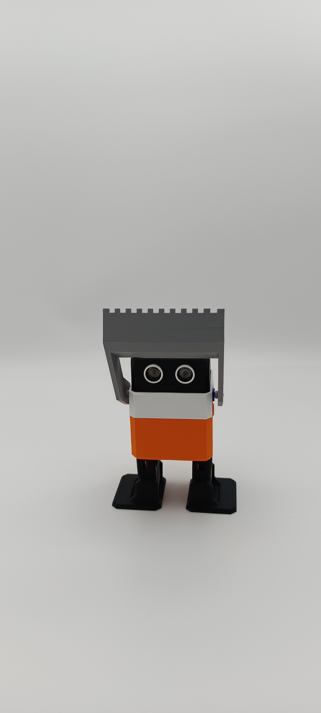

# Bienvenue sur notre documentation pour le projet Otto!

[Notre projet sur Onshape](https://cad.onshape.com/documents/8bf1596e187e4bf357696c1b/w/fd2014de3f82dbc0fe876f24/e/3f9c09ec674ba6faa442c708?renderMode=0&uiState=6a22d87ad5e36997ce2f5d43){: .btn .btn-primary .fs-5 .mb-4 .mb-md-0 .mr-2 }
[Notre repo GitHub](https://github.com/Makerspace-Amiens/template-project){: .btn .fs-5 .mb-4 .mb-md-0 }

<iframe height="600" width="100%" src="https://modelembedder.net/embed?did=2860ed3d58f1b518e6857770&wvm=v&wvmid=6280fca954e7770df59e5a2f&eid=0cab16137cd459ee83ebe56e&elementType=ASSEMBLY" frameborder="0"></iframe>

{: .warning }
>Pour intégrer la visualisation de votre projet Onshape, utilisez le site https://modelembedder.net . Activez le partage par lien via l'outil de partage de Onshape. n'oubliez pas d'activer l'option "export". Puis completez l'iframe ci-dessus avec le lien généré par le site https://modelembedder.net. Vous pouvez mettre à jour également le bouton avec le lien de partage de votre modèle.

## À propos du Projet

Le projet Otto que notre equipe a renomé l'ottobrico est né de l'envie de gagner une competition académique s'étant déroulé lors de la journée des projets nommé les Ottolympiades. Dans cet optique de victoire nous avons du faire un designe corresppondant aux multiples requis pour gagner un maximum d'épreuves aisi que de respecter certaines contraintes techniques tel que:

* une taille maximale quand tout les actionneurs sont déclenchés au maximum
* l'impossibilité de détruire les autres robots (logique pour le type de competition)
* l'utilisation des equipements disponible au makerspace uniquement
* la possibilité de le controller nous même via le logiciel remote XY

  En les suivant tous on as obtenu ce résultat:
  

## Vidéo
 enfin pour cette page de présentation voici une video expliquant plus en profondeur le projet:
 
Ici vous publierez la vidéo de votre projet. 
- 1min30 au format vertical
- Présentation du projet 
- Des explication du fonctionnement du projet
- Des vues du projet / Prototype / Application etc... 
- Des plans du fonctionnement (même basique ou des éléments séparés)
- Une conclusion
- Si en stockage local : <50mo
et une vidéo montrant la participation de celui ci a un combat de sumo (l'une des épreuves des ottolympiades)

<video src="images/vidmato1.mp4" controls title="Title"  style="width: 100%;"></video>
---
